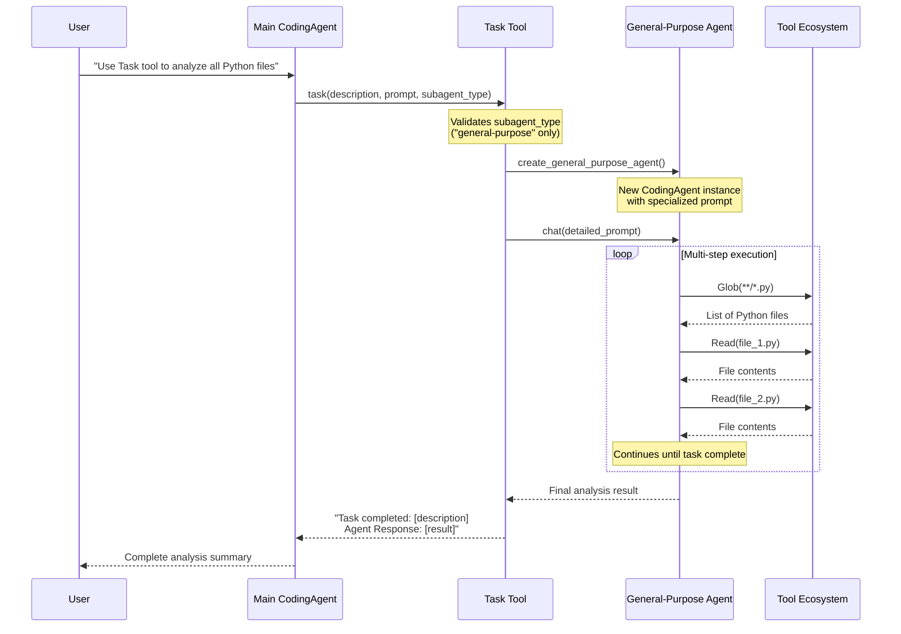
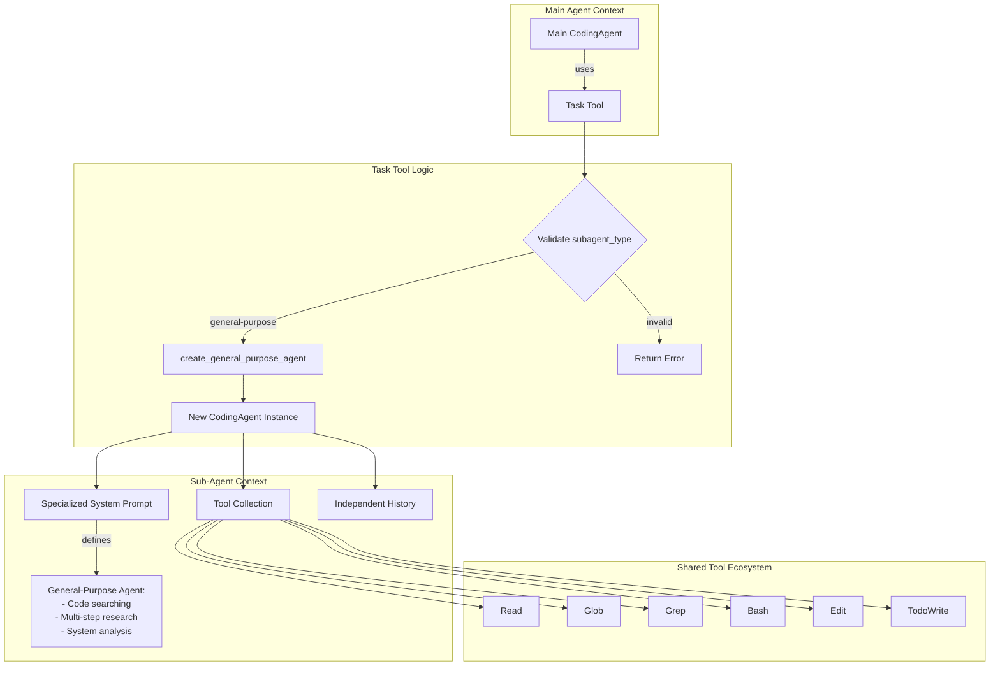
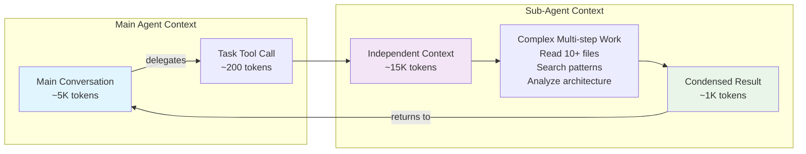

# Main System Flows

## Task Tool Architecture and Flow

The Task tool implements a **multi-agent delegation pattern** that enables the main coding agent to spawn specialized sub-agents for complex, autonomous work.

### Core Concept

The Task tool solves the **context compression problem** by:
1. Delegating complex multi-step tasks to independent agent instances
2. Running sub-agents in isolated contexts (separate conversation histories)
3. Returning only the final results to the main agent
4. Reducing context usage in the primary conversation

### Task Tool Flow Diagram



### Implementation Architecture



### Key Components

#### 1. Task Tool (`coding_agent/tools/task_tool.py`)
- **Entry Point**: `@tool("Task")` decorated function
- **Parameters**: 
  - `description`: Short task summary (3-5 words)
  - `prompt`: Detailed autonomous instructions
  - `subagent_type`: Agent specialization ("general-purpose" only)
- **Validation**: Ensures supported agent types
- **Orchestration**: Creates and manages sub-agent lifecycle

#### 2. General-Purpose Agent Factory
```python
def create_general_purpose_agent():
    """Create a general-purpose agent with specialized system prompt."""
    # Import here to avoid circular import
    from ..core.agent import CodingAgent
    
    agent = CodingAgent()
    
    # Override system prompt for general-purpose agent
    general_purpose_prompt = """You are an agent for Claude Code...
    
    Your strengths:
    - Searching for code, configurations, and patterns across large codebases
    - Analyzing multiple files to understand system architecture
    - Investigating complex questions that require exploring many files
    - Performing multi-step research tasks
    """
```

#### 3. Specialized System Prompt
The general-purpose agent receives a **focused system prompt** that:
- Emphasizes research and analysis capabilities
- Provides specific guidelines for file searches and code exploration
- Encourages thorough, multi-step investigation
- Requires final response with absolute file paths and code snippets

### Context Isolation Benefits



### Usage Patterns

#### 1. Code Analysis Tasks
```python
# Main agent delegates complex analysis
agent.chat('''Use the Task tool with:
- description: "analyze codebase"  
- prompt: "Search all Python files, understand architecture, identify main components"
- subagent_type: "general-purpose"
''')
```

#### 2. Multi-file Research
```python
# Research across multiple files without bloating main context
agent.chat('''Task tool: find all authentication-related code and security patterns
- description: "security audit"
- subagent_type: "general-purpose"  
''')
```

#### 3. Architecture Discovery
```python
# Deep codebase exploration
agent.chat('''Use Task tool to map the entire project structure and dependencies
- description: "map dependencies"
- subagent_type: "general-purpose"
''')
```

### Current Limitations

1. **Single Agent Type**: Only "general-purpose" implemented
2. **No Concurrency**: Sequential execution only
3. **No State Sharing**: Sub-agents cannot communicate with each other
4. **Same Process**: No process isolation (planned for future)

### Future Extensions (Step 2+)

1. **Additional Agent Types**:
   - `faang-engineer-architect`: System design expertise
   - `ui-ux-designer`: Design and user experience
   - `product-manager`: Feature prioritization

2. **Concurrent Execution**: Multiple agents running in parallel

3. **Agent Registry**: Dynamic agent loading from `~/.claude/agents/`

4. **Process Isolation**: True sandboxing for agent execution

### Error Handling

The Task tool includes comprehensive error handling:

```python
try:
    # Create the specialized agent
    if subagent_type == "general-purpose":
        agent = create_general_purpose_agent()
    else:
        return f"Error: Unsupported agent type: {subagent_type}"
    
    # Execute the task
    result = agent.chat(prompt)
    
    # Return the complete result
    return f"Task completed: {description}\n\nAgent Response:\n{result}"
    
except Exception as e:
    return f"Error executing task '{description}' with {subagent_type} agent: {str(e)}"
```

### Integration Points

The Task tool integrates seamlessly with the existing architecture:

1. **Tool Registration**: Added to `coding_agent/tools/__init__.py`
2. **Agent Integration**: Imported in `coding_agent/core/agent.py`
3. **Circular Import Prevention**: Lazy imports in `task_tool.py`
4. **Caching Support**: Inherits ephemeral caching from main agent

This architecture enables **powerful context compression** while maintaining the familiar tool-based interaction pattern that users expect.